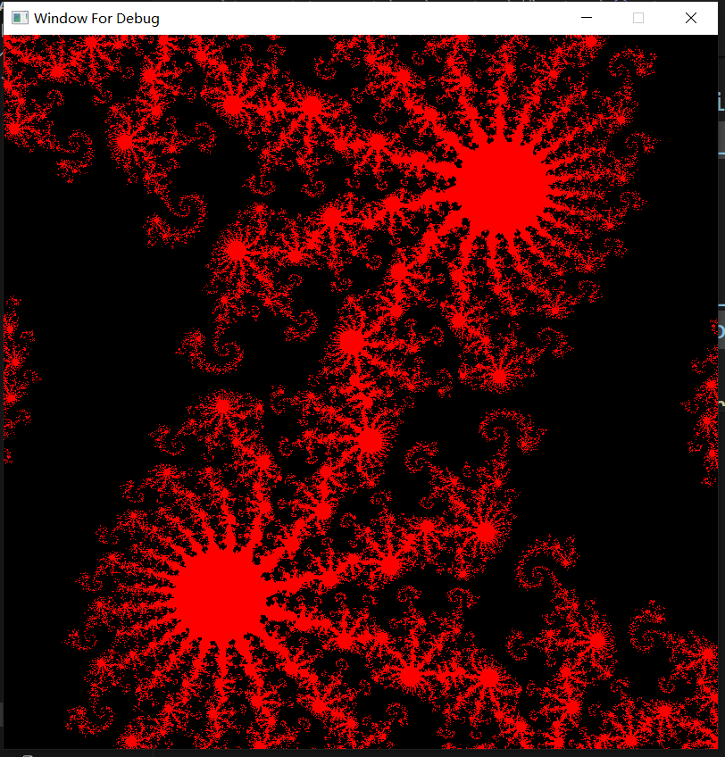
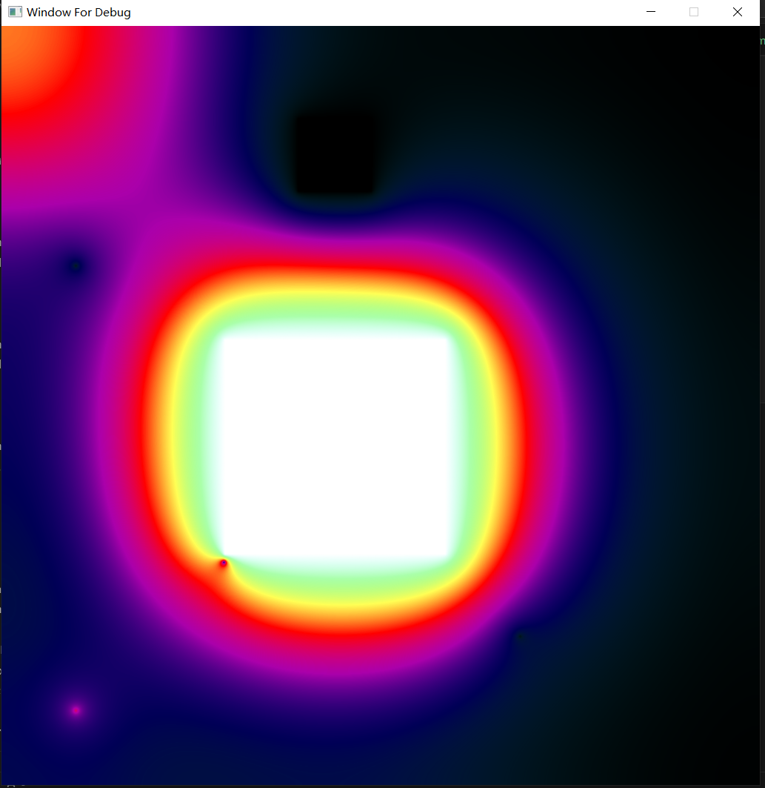

# Reading && Implementation
reference: [CUDA by Example: An Introduction to General-Purpose GPU](https://developer.nvidia.com/cuda-example)
# CUDA 
## x00-viewer_cpu

## x01-viewer_gpu
## cu00-enum_gpu
## cu01-set_gpu
## cu02-simple_kennal_param
## cu03-loop_gpu
## cu04-loop_grid_stride_gpu
## cu05-julia_gpu

## cu06-add_loop_blocks
## cu07-add_loop_blocks_grid_stride
## cu08-dot
## cu09-ripple

## cu10-ripple_shared_mem

## cu11-ray

## cu12-ray_const

## cu13-heat

