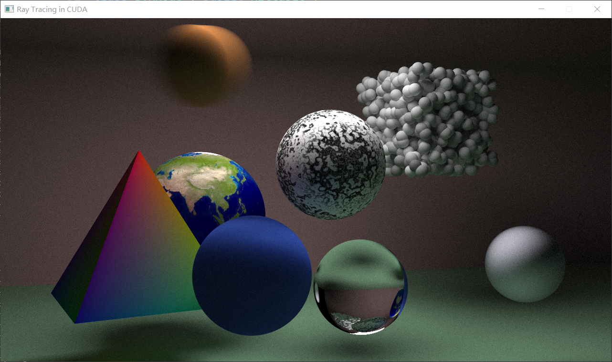

# Ray Tracing Using CUDA
reference: [Ray Tracing in One Weekend — The Book Series](https://raytracing.github.io/)

## Ray Tracing in One Weekend
### features
+ Movable Camera
+ Material: Diffuse, Meta, Dielectrics 
+ Defocus Blur
+ Geometry: Sphere

## Ray Tracing: The Next Week
### features
+ Motion Blur
+ Bounding Volume Hierarchies 
+ Texture Mapping
+ Perlin Noise
+ Geometry: Quadrilaterals, Triangle
+ Lights
+ Instance 
+ Volumes

## Ray Tracing: The Rest of Your Life 
### features
+ Light Scattering
+ Importance Sampling
+ Sampling Lights Directly
+ Mixture Densities

