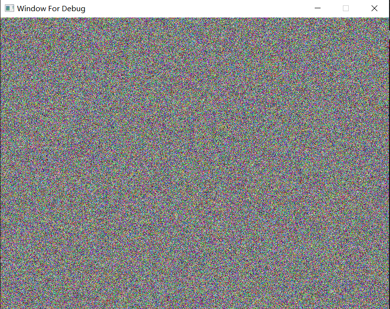

# Reading && Implementation

# 02 Ray Tracing Using CUDA
reference: [Ray Tracing in One Weekend — The Book Series](https://raytracing.github.io/)
## Ray Tracing in One Weekend
### features
+ Movable Camera
+ Material: Diffuse, Meta, Dielectrics 
+ Defocus Blur
+ Geometry: Sphere

## Ray Tracing: The Next Week
### features
+ Motion Blur
+ Bounding Volume Hierarchies 
+ Texture Mapping
+ Perlin Noise
+ Geometry: Quadrilaterals, Triangle
+ Lights
+ Instance 
+ Volumes

# 01 learn cuda 02
# CUDA by Example
reference: [CUDA by Example: An Introduction to General-Purpose GPU](https://developer.nvidia.com/cuda-example)
### x00-viewer_cpu

### x01-viewer_gpu
### cu00-enum_gpu
### cu01-set_gpu
### cu02-simple_kennal_param
### cu03-loop_gpu
### cu04-loop_grid_stride_gpu
### cu05-julia_gpu

### cu06-add_loop_blocks
### cu07-add_loop_blocks_grid_stride
### cu08-dot
### cu09-ripple

### cu10-ripple_shared_mem

### cu11-ray

### cu12-ray_const

### cu13-heat

# 00 learn cuda 01
# Parallel101
reference: [Parallel101](https://github.com/parallel101/course/tree/master/08)
### 00-hello_compile_it
### 01-hello_run_kernel_with_global_function
### 02-hello_device_synchronize
### 03-hello_device_function
### 04-hello_host_function
### 05-hello_default_host_function
### 06-hello_device_and_host_function_same_time
### 07-hello_consexpr_function_as_host_device_and_host_function
### 08-hello_macro_CUDA_ARCH
### 09-hello_specify_CUDA_ARCH_in_CMakeList
### 10-thread_1x3
### 11-thread_threadIdx
### 12-thread_blockDim
### 13-thread_2x3
### 14-thread_gridDim
### 15-thread_flatten_thread
### 16-thread_3d_grid_and_block
### 17-thread_2d_grid_and_block
### 18-thread_split_specification_and_implementation_of_function
### 19-thread_dynamic_call_kernel_in_kernel
### 20-memory_can_not_return_value_directly_from_kernel
### 21-memory_return_value_explicitly_from_kernel
### 22-memory_check_cuda_error
### 23-memory_check_cuda_error_with_helper
### 24-memory_allocate_memory_on_gpu_then_free
### 25-memory_cpu_can_not_use_gpu_memory_directly
### 26-memory_gpu_can_not_use_cpu_memory_directly
### 27-memory_cudaMemcpy_auto_call_device_synchronize
### 28-memory_copy_data_from_gpu_to_cpu
### 29-memory_unified_memory_access_by_both_cpu_and_gpu
### 30-array_allocate_array
### 31-array_parallele_assign
### 32-array_grid_strip_loop
### 33-array_from_theads_to_blocks
### 34-array_from_theads_to_blocks_handling_array_out_of_bound
### 35-array_from_theads_to_blocks_handling_array_out_of_bound_grid_strip_loop
### 36-cpp-allocator_for_vector
### 37-cpp-allocator_for_vector_skip_cpu_init
### 38-cpp-template_kernel_function
### 39-cpp-pass_functor_to_kernel
### 40-cpp-pass_lambda_to_kernel
### 41-cpp-pass_lambda_to_kernel_with_captured_data
### 42-cpp-pass_lambda_to_kernel_with_captured_data1
### 43-math_parallel_for_sinf
### 44-math_parallel_for_sinf_compare_cpu_and_gpu
### 45-math_parallel_for___sinf_compare_cpu_and_gpu
### 46-math_parallel_for_sum_vector
### 47-thrust_universal_vector
### 48-thrust_host_and_device_vector
### 49-thrust_generate
### 50-thrust_for_each
### 51-thrust_counting_interator
### 52-thrust_zip_iterator
### 53-atomic_naive_wrong_sum
### 54-atomic_AtomicAdd
### 55-atomic_localSum_AtomicAdd
### 56-atomic_localSum_AtomicAdd_use_return
### 57-atomic_localSum_AtomicMax
### 58-atomic_from_atomicCAS_to_atomicAdd
### 59-atomic_from_atomicCAS_to_floatAtomicAdd
### 60-block_no_atomic_sum_vertical_partition
### 61-block_no_atomic_sum_vertical_partition_in_gpu_sum
### 62-block_no_atomic_sum_shared_mem_reduction_sum_WRONG
### 63-block_no_atomic_sum_shared_mem_reduction_sum_block_syncthreads
### 64-block_no_atomic_sum_shared_mem_reduction_sum_block_syncthreads_warp_WRONG
### 65-block_no_atomic_sum_shared_mem_reduction_sum_block_syncthreads_warp
### 66-block_no_atomic_sum_shared_mem_reduction_sum_block_syncthreads_warp_lowDivergence
### 67-block_no_atomic_sum_shared_mem_reduction_sum_block_syncthreads_warp_lowDivergence_preSum
### 68-block_no_atomic_sum_shared_mem_reduction_sum_block_syncthreads_warp_lowDivergence_preSum_cpuSum
### 69-block_no_atomic_sum_shared_mem_reduction_sum_block_syncthreads_warp_lowDivergence_preSum_cpuSum_recursivecpugpu
### 70-narray_transpose_naive
### 71-narray_transpose_naive_2d
### 72-narray_transpose_naive_2d_shared_mem
### 73-stencil_x_blur
### 74-stencil_y_blur
### 75-stencil_jacobi_iteration
### 76-stencil_jacobi_iteration_shared_mem_four_in_one